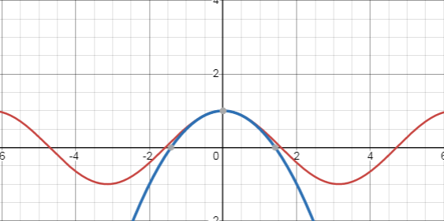

# Taylor Series

## Intro
[Taylor series](#taylor-series) is a way to express any function (usually a non-polynomial) as an approximated series sum of polynomials!

[Maclaurin series](#maclaurin-series) is just a special case of Taylor series that simplifies the general formula for functions around zero.

It means that we can replace functions like exponential ($e^x$), logarithms ($\log(x)$), trigonometric functions ($\sin x$, $\cos x$, etc.) with polynomials like $1 - \frac{x^2}{2!}$.

For example, $\cos x$ can be approximated by $1 - \frac{x^2}{2!}$ in the range -0.5 to 0.5 radians. The general formula for this is:
 $\sum_{k=0}^n (-1)^k \frac{x^{2k}}{(2k)!}$
 
Including more terms would lead to higher accuracy.

Have a look at this diagram from [Desmos](https://www.desmos.com):

This above picture shows `taylor series about zero` for cosx,
 also called `maclaurin series` for cos x.

You can fiddle around with this graph [on desmos](https://www.desmos.com/calculator/ltdmpiagjp)

[How can I make such equations for $\sin x$, $\cos x$, $e^x$ by myself?](#taylor-series)

# Taylor Series

- Derivation
- Use case (demostrate differnt region of approxiamtion with different values of a)
- Examples with graphs
- Questionnaires

# Maclaurin Series

- Derivation (set $a=0$ in Taylor series)
- Use case
- Examples with graphs
- Questionnaires

# Bibliography
- Class Lectures by [Assistant Professor Sandeep Kaur Gill](http://gndec.ac.in/faculty/)
- 3Blue1Brown (YouTube channel)

# Related Links
- [Math-1 Syllabus](https://github.com/gne-ldh/ClassNotes/edit/main/Notes/Maths/index.md)
- [Weekly Topic List](https://github.com/gne-ldh/ClassNotes/edit/main/Notes/Maths/topic-menu)

# Editor's Tools
- [Check out this blog on how to render math equations in markdown with mathjax](https://mantejjosan.github.io/math-made-easy/tut/)

